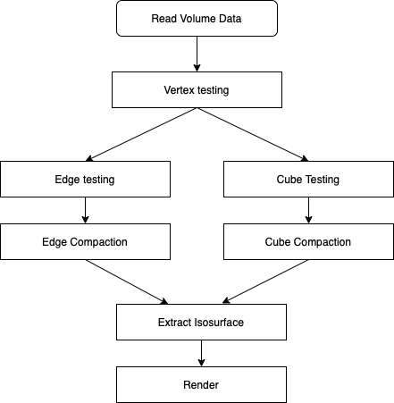
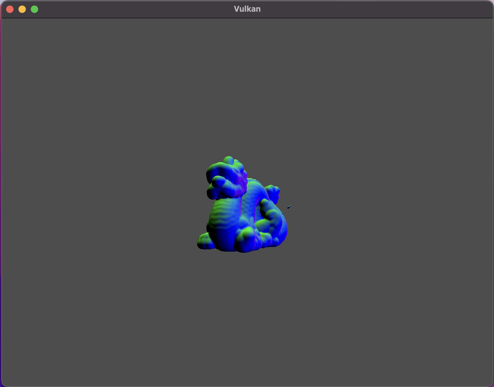
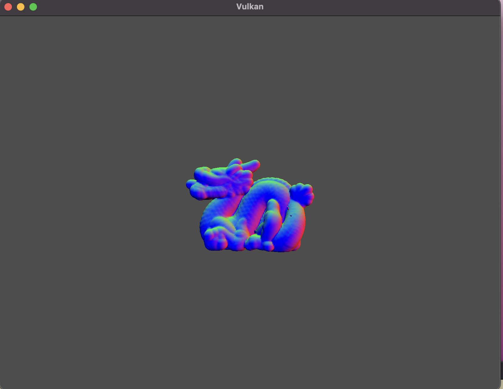

# Vulkan-MarchingCube
---
## What is Marching Cube?
- Marching cubes algorithm is algorithm for polygonizing of scalar field data(like X-ray or MRI).  
This example implemented [Marching cube algorithm](https://dl.acm.org/doi/10.1145/37401.37422) but added process to make triangle mesh output, not triangle soup.
## Pipeline

## Installation
- Ubuntu
1. Download VulkanSDK from [here](https://https://www.lunarg.com/vulkan-sdk/) 
2. Extract VulkanSDK you downloaded.
```
$ tar -zxvf where/vulkan_sdk/located
```
3. Copy header files.
- If you go to extracted directory. You can find x86\_64 directory.  
move to x86\_64 then you can find "include" directory.
copy files inside include to system include directory.
```
$ sudo cp -r vulkan_sdk_location/x86_64/include/* /usr/local/include/
```

4. Setup system environments
* recommed use setup-env.sh file inside your VulkanSDK directory.  
or add it on your shell profile.(.zshrc or .bashrc etc...)
```
source VulkanSDK/setup-env.sh
```
6. Install dependencies
```
$ sudo apt install libglfw3-dev libglm-dev cmake g++ make
```
7. Clone this example && build
```
$ git clone https://github.com/elensar92/Vulkan-MarchingCube
$ cd ./Vulkan-MarchingCube
$ git submodule update --init --recursive
$ cmake CMakeLists.txt
$ make
```
8. launch Vulkan\_MarhichingCube binary file
```
$./Vulkan\_MarchingCube
```
- Mac OS
1. Install CommandLine Tools if it is not installed.
```
$ sudo xcode-select install
```
2. Download VulkanSDK from [here](https://https://www.lunarg.com/vulkan-sdk/) 
- Recommend using .dmg file
3. Install Vulkan SDK using dmg.
- After you installed it. you can find VulkanSDK directory on your Home Directory.  
4. Install [HomeBrew](https://brew.sh/index_ko) using bellow command
```
$ /bin/bash -c "$(curl -fsSL https://raw.githubusercontent.com/Homebrew/install/HEAD/install.sh)"
```
5. Install dependencies
```
$ brew install glfw3
$ brew install glm
```
6. Install CMake application for Mac OS from [here](https://cmake.org/download/)
7. Clone this example && build
```
$ git clone https://github.com/elensar92/Vulkan-MarchingCube
$ cd Vulkan-MarchingCube
$ cmake CMakeLists.txt
$ make
$ ./Vulkan-MarchingCube
```
## Result


## Dependencies 
1. OS
   * Mac OS(above 11.x versions)
   * Linux
     * Ubuntu 20.04 lts, 22.04 lts
     * Rocky Linux 8.5
     * Rasbian Bullseye
   * Windows 10
   		
2. Vulkan Version
   - Support above 1.1x versions. but recommend using above 1.2.x
3. GLFW3
4. GLM
5. Mingw-w64 (Windows only)